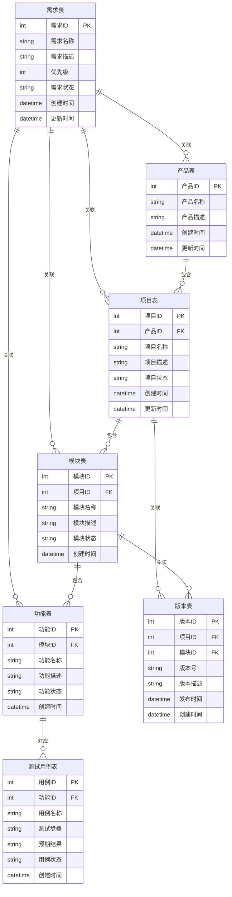
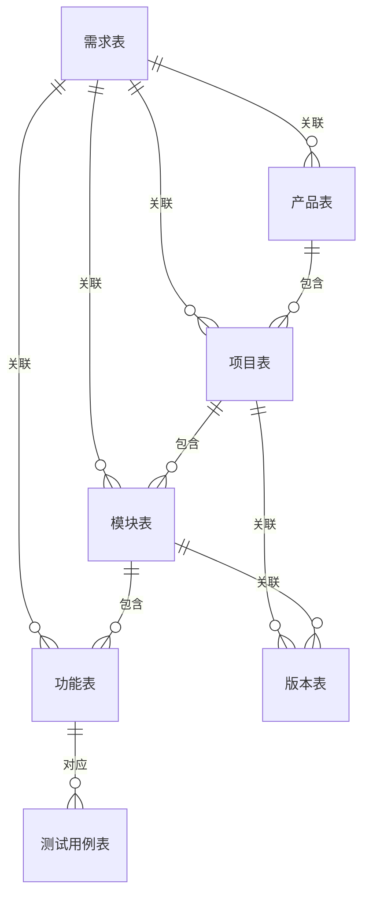

# 软件项目管理平台 - 实体关系思维导图

## 实体关系图（ER图）

### 核心版（仅实体关系）

## ER图说明

### 实体结构

ER图包含7个核心实体，体现了需求驱动的产品开发管理流程：

1. **需求表**：业务需求的起点，可以关联到产品、项目、模块、功能
2. **产品表**：产品层级，位于最顶层
3. **项目表**：执行层级，属于产品
4. **模块表**：技术层级，属于项目
5. **功能表**：功能层级，属于模块
6. **版本表**：版本/迭代维度，关联项目和模块
7. **测试用例表**：测试层级，关联功能

### 关系说明

#### 1. 需求驱动的业务流
- **需求表 → 产品表**：需求可以关联到产品
- **需求表 → 项目表**：需求可以关联到项目
- **需求表 → 模块表**：需求可以关联到模块
- **需求表 → 功能表**：需求可以关联到功能

#### 2. 层级归属关系
- **产品表 → 项目表**：一个产品包含多个项目（一对多）
- **项目表 → 模块表**：一个项目包含多个模块（一对多）
- **模块表 → 功能表**：一个模块包含多个功能（一对多）

#### 3. 版本关联
- **项目表 → 版本表**：项目可以关联版本（一对多）
- **模块表 → 版本表**：模块可以关联版本（一对多）

#### 4. 测试关联
- **功能表 → 测试用例表**：功能对应测试用例（一对多）

### 设计特点

1. **需求驱动**：以需求表为业务起点，需求可以灵活关联到各个层级
2. **层级清晰**：产品 → 项目 → 模块 → 功能，形成清晰的层级结构
3. **版本管理**：项目和模块都可以关联版本，支持版本规划和发布
4. **测试覆盖**：功能直接关联测试用例，确保质量保证

